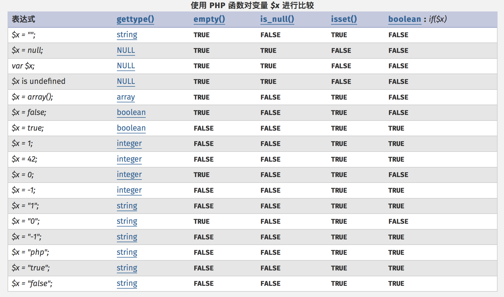
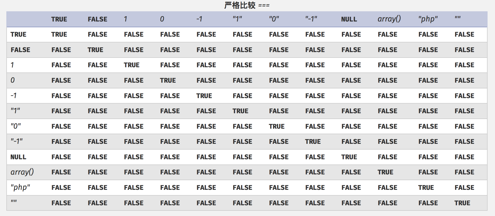
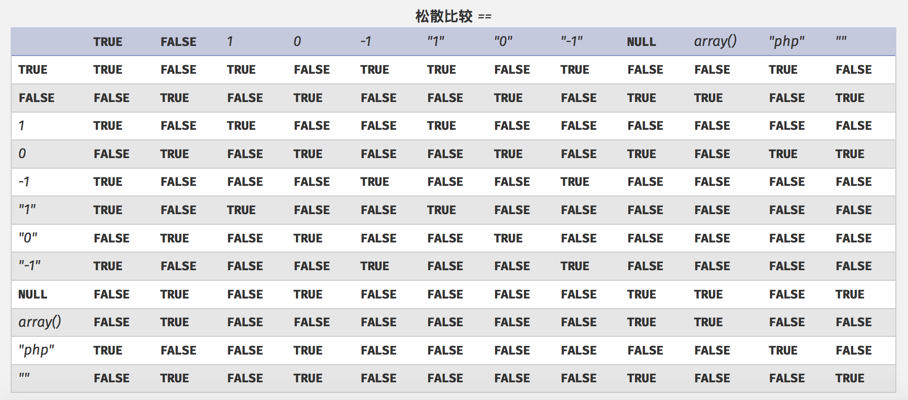

### PHP 的数据类型 

PHP 支持 9 种原始数据类型。

##### 四种标量类型：

* boolean（布尔型）
* integer（整型）
* float（浮点型，也称作 double)
* string（字符串）

##### 三种复合类型：

* array（数组）
* object（对象）
* callable（可调用）

##### 两种特殊类型：

* resource（资源）
* NULL（无类型）

##### 一些伪类型：

* mixed（混合类型）
* number（数字类型）
* callback（回调类型，又称为 callable）
* array|object（数组 | 对象类型）
* void （无类型）

##### 伪变量
* $...

可能还会读到一些关于“双精度（double）”类型的参考。
实际上 `double` 和 `float` 是相同的，由于一些历史的原因，这两个名称同时存在。

变量的类型通常不是由程序员设定的，确切地说，是由 PHP 根据该变量使用的上下文在运行时决定的。

### PHP 类型比较表

> [PHP 类型比较表](http://php.net/manual/zh/types.comparisons.php)
> 
> HTML 表单并不传递整数、浮点数或者布尔值，它们只传递字符串。要想检测一个字符串是不是数字，可以使用 `is_numeric()` 函数。
> 
> 在没有定义变量 `$x` 的时候，诸如 `if ($x)` 的用法会导致一个 **E_NOTICE** 级别的错误。所以，可以考虑用 `empty()` 或者 `isset()` 函数来初始化变量。
> 

